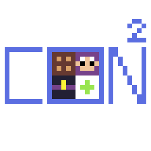

# ConvenientContainers (ConCon)

Serverside mod for convenient, portable containers and workstations supporting Fabric and NeoForge.

Currently supports Shulker Boxes, Ender Chests, and Crafting Tables.

Open their menus by right clicking while looking at air.

Uses [Architectury](https://github.com/architectury) for cross-loader mod development.
